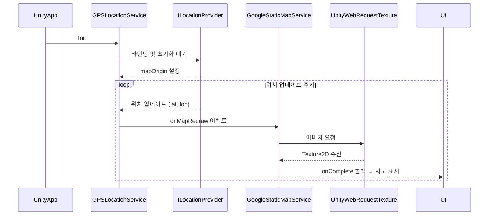
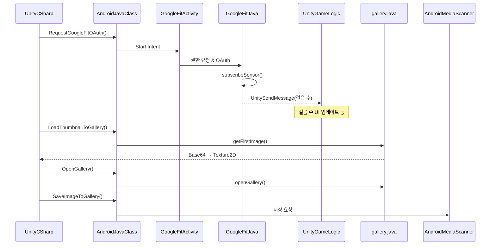
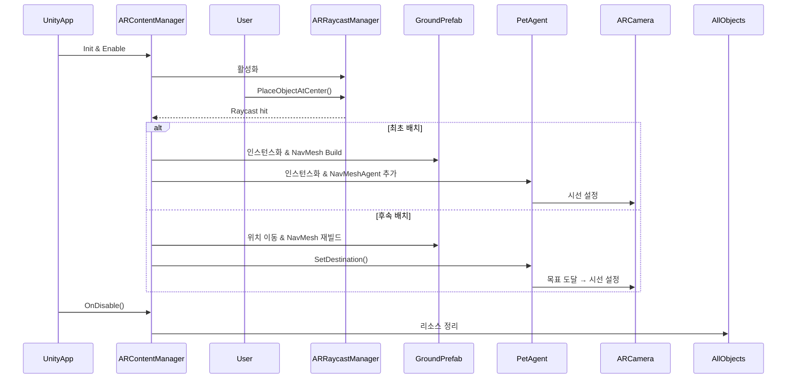
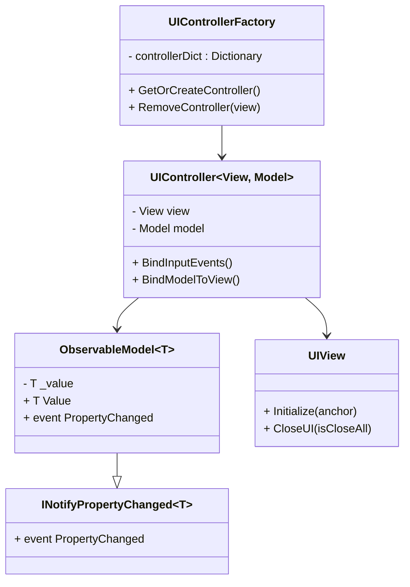

# 🐾 뿌꾸민 – POOKOOMIN

## 🎮 개요

  

닌텐도의 AR 게임 「피크민 블룸」을 보고 영감을 받아 만든 AR 게임입니다. 🌳

* **프로젝트 이름**: Pookoomin 🏠
* **프로젝트 지속기간**: 2025.06.13 ~ 2025.06.27
* **개발 엔진 및 기술**: Unity(AR Foundation), C#, Google static map API, Google Fit API, Android Studio(Java)
* **팀 멤버**: 팀 "뿌꾸의 산책" (김민정, 정보연, 한태규)

---

## 📖 게임 영상

---
## 📄 목차  
* [🕹️ 프로젝트 구현](#-프로젝트-구현)
  * [Google Static Map API](#google-static-map-api)
    * [🚀 워크플로우: 현재 위치 기반 지도 로딩 과정](#-워크플로우-현재-위치-기반-지도-로딩-과정)
  * [Google Fit API & Android Native Code (Java)](#google-fit-api--android-native-code-java)
    * [🚀 워크플로우: Google Fit 권한 요청 및 걸음 수 동기화, 갤러리 접근](#-워크플로우-google-fit-권한-요청-및-걸음-수-동기화-갤러리-접근)
  * [AR Foundation](#ar-foundation)
    * [🚀 워크플로우: AR 콘텐츠 인식 및 배치 과정](#-워크플로우-ar-콘텐츠-인식-및-배치-과정)
  * [UI : MVC](#ui--mvc)

---
## 🕹️ 프로젝트 구현

### Google Static Map API
### 🚀 워크플로우: 현재 위치 기반 지도 로딩 과정
게임을 실행하면, 실행한 디바이스에 따라 프로바이더 결정한다.
- 에디터에서는, 현재 위치를 결정할 수 없으므로 직접 플레이어를 Input값에 따라 이동시켜 위치를 인식한다.
- 디바이스에서는, 현재 위도, 경도 값을 받아서 실제 위치를 인식한다.

매 업데이트 문마다, 현재 위치를 갱신 시켜서 Google Static Map API로 지도 값 요청

지도값을 텍스쳐로 받아서, 플레이어를 중심으로 9칸 이미지를 갱신한다.
 

### Google Static Map API
🚀 워크플로우: Google Fit 권한 요청 및 걸음 수 동기화, 갤러리 접근
Unity에서 Java 클래스를 호출하여 Google Fit 권한 요청 및 센서 등록을 진행합니다.
(개별 자바 클래스는 안드로이드 스튜디오 외부 라이브러리로 제작해서 aar 파일 형태로 빌드 :: 외부 플러그인)

걸음 수 데이터는 UnitySendMessage를 통해 유니티로 전달되어 게임 로직과 UI에 반영됩니다.

갤러리 접근 기능은 Java 측에서 이미지 조회/앱 실행/저장 기능을 제공하며 Unity와 연동됩니다.

---

### AR Foundation

### 🚀 워크플로우: AR 콘텐츠 인식 및 배치 과정

### UI : MVC
Model (ObservableModel<T>)
값 변경 시 이벤트를 발생시키는 데이터 모델.
뷰에 직접 접근하지 않고 데이터 변경만 관리합니다.

View (UIView)
Unity MonoBehaviour를 상속한 UI 요소입니다.
모델의 변화에 따라 UI를 갱신하며, 사용자 입력을 컨트롤러로 전달합니다.

Controller (UIController<View, Model>)
모델과 뷰를 연결하며, 입력 처리 및 모델 → 뷰 바인딩을 담당합니다.

Factory (UIControllerFactory)
DI 없이 컨트롤러를 생성/캐싱/제거하는 팩토리 클래스입니다.

---
